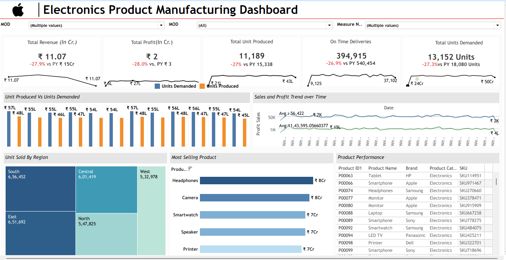
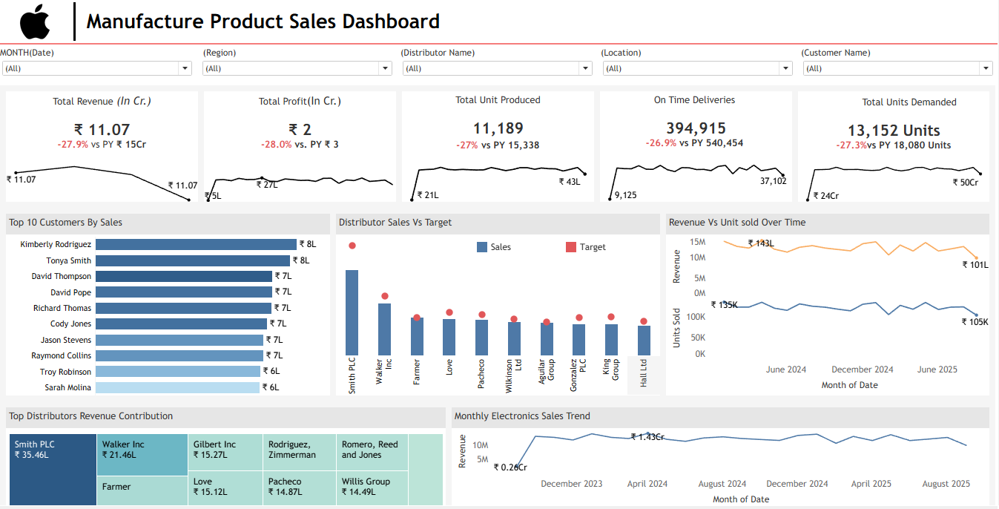
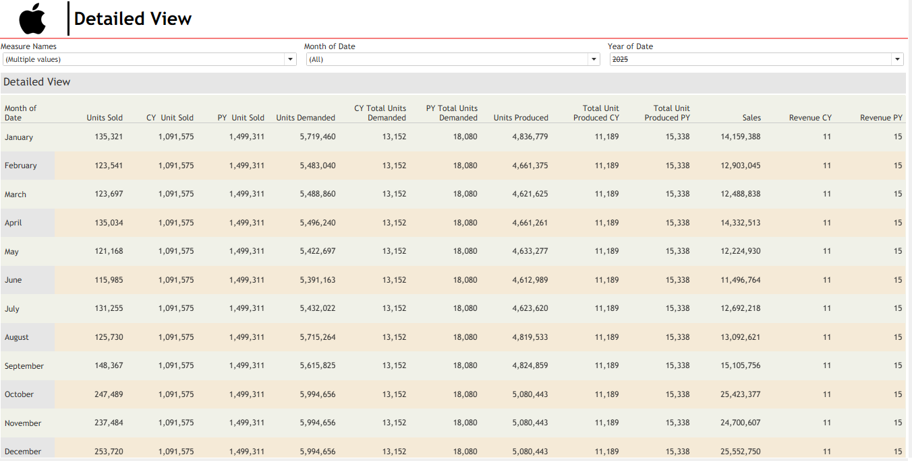

# 📊 Electronics Product Manufacturing & Sales Dashboard

## 📝 Project Description
This project showcases an end-to-end **Electronics Product Manufacturing and Sales Dashboard** developed in **Tableau**.  
It provides actionable insights into **production performance, demand vs supply, sales trends, profitability, and delivery efficiency**, helping stakeholders make data-driven decisions.

---

## 🛠️ Tech Stack
- **Tableau Desktop** – Dashboard development & data visualization  
- **Microsoft Excel / CSV** – Data storage and preprocessing  
- **Tableau Calculated Fields** – KPI logic, YoY comparison, performance metrics  
- **GitHub** – Project version control and portfolio hosting  

---

## 📂 Data Source
- Simulated manufacturing and sales data  
- Includes:
  - Production data (Units Produced, On-Time Deliveries)
  - Sales data (Revenue, Profit, Units Sold)
  - Demand data (Units Demanded)
  - Regional, product, distributor, and customer-level details  

---

## ⭐ Features
- High-level KPI cards with **Year-over-Year (YoY) comparison**
- Manufacturing analysis: **Units Produced vs Units Demanded**
- Sales & profit **trend analysis over time**
- Regional and distributor-wise performance insights
- Top customers and top-selling products analysis
- Target vs actual sales performance tracking
- Interactive filters for **Date, Region, Distributor, Product, and Customer**

---

## 🚀 Highlights
- Integrated **Manufacturing + Sales** analytics in a single solution  
- Clear visibility into **supply-demand gaps**
- Performance tracking across **current year vs previous year**
- Drill-down **detailed monthly view** for in-depth analysis
- Business-ready dashboard design suitable for **operations, sales, and leadership teams**

 ## 📸 Dashboard Screenshots

# Manufacturing Overview
Show what the dashboard looks like. - 

# Sales Overview

# Detailed View

